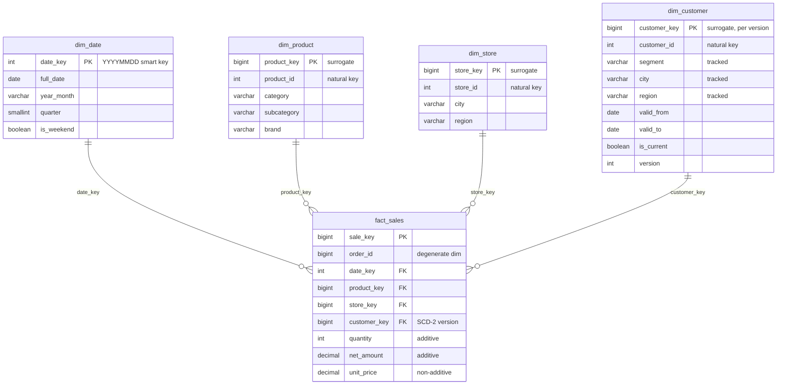

# warehouse-patterns

A senior BI engineer's reference on dimensional modelling - star schemas,
slowly-changing dimensions, grain, conformed dimensions and the ETL/SSIS loading
pattern - written up as prose *and* backed by a small star schema you can build
and query on synthetic data.

[](https://github.com/mikitadaroshkin/warehouse-patterns/actions/workflows/ci.yml)
[](LICENSE)
[](requirements.txt)


## What this is

A patterns write-up from my BI / data-warehousing years, distilled into the
decisions that actually matter when you model a warehouse - and paired with a
runnable demo so the patterns are more than assertions.

- The write-ups live in [`docs/`](docs/): the design reasoning, with example DDL.
- The demo ([`sql/`](sql/) + [`warehouse_demo/`](warehouse_demo/)) builds a
  small retail-sales star schema in DuckDB, loads deterministic synthetic data,
  applies a Slowly-Changing-Dimension Type-2 load, and runs the analytical queries
  whose output appears below.

Scope, stated plainly so the README never claims more than the code does:

- Every number in this README is real, captured from `python build_demo.py` on
  the synthetic data in this repo - not illustrative, not hand-written.
- All data is synthetic and generated from a fixed seed
  ([`warehouse_demo/synthetic.py`](warehouse_demo/synthetic.py)). There is no
  client, proprietary, or real personal data anywhere - no company names, no
  real schemas. The BI experience is real; the examples are invented to demonstrate
  it.
- This is a reference / write-up repo, not a service. The "product" is the
  patterns and the runnable SQL demo, nothing more.

## Patterns

Each write-up is a focused deep dive; this is the map.

| Pattern | What it covers |
|---|---|
| [Star vs. snowflake](docs/01-star-vs-snowflake.md) | why star is the default, when to normalise a branch, outriggers |
| [Facts and dimensions](docs/02-facts-and-dimensions.md) | additive / semi-additive / non-additive measures, degenerate dimensions, fact flavours |
| [Grain and surrogate keys](docs/03-grain-and-surrogate-keys.md) | declaring grain first, why surrogates, the date-key exception, the unknown member |
| [Slowly-changing dimensions](docs/04-slowly-changing-dimensions.md) | SCD Type 1 / 2 / 3, point-in-time attribution, hybrid dimensions |
| [Conformed dimensions](docs/05-conformed-dimensions.md) | drill-across, the bus matrix, conformed rollups |
| [ETL & the SSIS loading pattern](docs/06-etl-ssis-loading.md) | staging, the SCD-2 merge, key lookups, idempotency |

The two load-bearing pieces of DDL, so the shape is on the page:

```sql
-- Fact: grain = one product line on one sales order. FKs + measures only.
CREATE TABLE fact_sales (
    sale_key      BIGINT PRIMARY KEY,
    order_id      BIGINT NOT NULL,                              -- degenerate dimension
    date_key      INTEGER NOT NULL REFERENCES dim_date (date_key),
    product_key   BIGINT  NOT NULL REFERENCES dim_product (product_key),
    store_key     BIGINT  NOT NULL REFERENCES dim_store (store_key),
    customer_key  BIGINT  NOT NULL REFERENCES dim_customer (customer_key),
    quantity      INTEGER NOT NULL,                              -- additive
    net_amount    DECIMAL(12, 2) NOT NULL,                       -- additive
    unit_price    DECIMAL(10, 2) NOT NULL                        -- non-additive (a rate)
);

-- SCD Type-2 dimension: one row per version, windows tile the timeline.
CREATE TABLE dim_customer (
    customer_key  BIGINT PRIMARY KEY DEFAULT nextval('seq_customer_key'),
    customer_id   INTEGER NOT NULL,     -- natural key, stable across versions
    segment       VARCHAR NOT NULL,     -- tracked (Type 2)
    city          VARCHAR NOT NULL,     -- tracked (Type 2)
    region        VARCHAR NOT NULL,     -- tracked (Type 2)
    valid_from    DATE NOT NULL,
    valid_to      DATE NOT NULL,        -- 9999-12-31 while current
    is_current    BOOLEAN NOT NULL,
    version       INTEGER NOT NULL
);
```

Full DDL: [`sql/01_dimensions.sql`](sql/01_dimensions.sql),
[`sql/02_fact.sql`](sql/02_fact.sql).

## Star schema demo

A retail-sales star: one `fact_sales` at order-line grain, four dimensions.
`dim_customer` is Slowly-Changing Type 2, so a fact points at the customer *version*
that was current on the order date.



### Building it

```bash
python -m venv .venv && source .venv/bin/activate
pip install -r requirements.txt
python build_demo.py          # build + load + run the queries, print the output below
```

The load summary from that run - 200 customers arriving as two source snapshots
six months apart, of which 54 changed a tracked attribute and were versioned:

```
loaded  products=24  stores=8  customers=200  customer_versions=254  fact_rows=5000

SCD-2 customer load (per source snapshot):
  as_of 2024-01-01:  inserted=200  versioned=0    unchanged=0
  as_of 2024-07-01:  inserted=0    versioned=54   unchanged=146

idempotency re-run of last snapshot:  rows 254 -> 254  (load {'inserted': 0, 'versioned': 0, 'unchanged': 200})
```

The idempotency line is the point: re-applying the same snapshot is a no-op, so the
load is safe to re-run after a failure.

### Query output (captured from the run)

Net revenue by category by month - the canonical star query: slice the fact by
one dimension (`product.category`), roll up along another (`date.year_month`).
[`sql/analytics/category_month_revenue.sql`](sql/analytics/category_month_revenue.sql)

```
category          | 2025-01 | 2025-02 | 2025-03 | 2025-04 | 2025-05 | 2025-06 | h1_2025_total
------------------+---------+---------+---------+---------+---------+---------+--------------
Electronics       | 178134  | 85776   | 184233  | 131285  | 145905  | 128951  | 854284
Sports & Outdoors | 57130   | 47739   | 44787   | 63697   | 37621   | 49505   | 300480
Home & Kitchen    | 37706   | 22941   | 29595   | 23287   | 24681   | 26640   | 164850
Apparel           | 21501   | 18097   | 16368   | 19647   | 19633   | 24489   | 119735
Office Supplies   | 5204    | 4613    | 6644    | 6986    | 5051    | 6255    | 34753
```

SCD Type-2 history - the version trail for the first three customers that
changed. Windows tile the timeline (`valid_to` of v1 = `valid_from` of v2); exactly
one row per customer is current.
[`sql/analytics/scd2_customer_history.sql`](sql/analytics/scd2_customer_history.sql)

```
customer_key | customer_id | segment     | city       | region | valid_from | valid_to   | is_current | version
-------------+-------------+-------------+------------+--------+------------+------------+------------+--------
2            | 5001        | Corporate   | Northgate  | North  | 2024-01-01 | 2024-07-01 | False      | 1
201          | 5001        | Consumer    | Rivermouth | North  | 2024-07-01 | 9999-12-31 | True       | 2
9            | 5008        | Consumer    | Westcliff  | West   | 2024-01-01 | 2024-07-01 | False      | 1
202          | 5008        | Consumer    | Southbank  | South  | 2024-07-01 | 9999-12-31 | True       | 2
14           | 5013        | Home Office | Kingsley   | South  | 2024-01-01 | 2024-07-01 | False      | 1
203          | 5013        | Consumer    | Rivermouth | North  | 2024-07-01 | 9999-12-31 | True       | 2
```

Why SCD-2 earns its keep - the same sales, attributed two ways.
`point_in_time` joins each sale to the customer version current *on the sale date*;
`restated_current` re-attributes every sale to the customer's *current* segment (the
answer a Type-1 overwrite would give). Grand totals match to the cent; the
per-segment split does not - and that gap is the history Type-1 would have destroyed.
[`sql/analytics/segment_revenue_pit_vs_current.sql`](sql/analytics/segment_revenue_pit_vs_current.sql)

```
segment     | net_revenue_point_in_time | net_revenue_restated_current | delta
------------+---------------------------+------------------------------+-------
Consumer    | 1181361                   | 1228707                      | 47347
Corporate   | 1416119                   | 1344733                      | -71386
Home Office | 1821956                   | 1845995                      | 24039
```

Reproduce any of these directly:

```bash
python build_demo.py                       # all of the above
python build_demo.py warehouse.duckdb      # also persist a DuckDB file to explore

# Run any query against the persisted warehouse (uses the pip-installed package):
python -c "import duckdb; print(duckdb.connect('warehouse.duckdb').execute(open('sql/analytics/segment_revenue_pit_vs_current.sql').read()).fetchall())"

# Or, if you have the standalone DuckDB CLI installed (a separate download):
#   duckdb warehouse.duckdb ".read sql/analytics/segment_revenue_pit_vs_current.sql"
```

## Design notes

- Grain before columns. The fact's grain - *one product line on one order* - is
  declared first; dimensionality and additivity follow from it. Fine grain is
  future-proof (aggregate up, never down); pre-aggregates come later, alongside the
  atomic fact, never instead of it. -> [grain](docs/03-grain-and-surrogate-keys.md)
- SCD tradeoffs are per attribute. Type 1 (overwrite) for corrections where
  history should re-state; Type 2 (versioned rows) for real-world changes where past
  facts belong to the old value. Most dimensions are hybrid. The demo tracks
  `segment` / `city` / `region` as Type 2 and quantifies the difference it makes.
  -> [SCD](docs/04-slowly-changing-dimensions.md)
- Star unless a branch forces a snowflake. Redundant text in a dimension is
  nearly free on a columnar engine (dictionary-encoded); extra joins are not.
  Snowflake a branch only for a concrete master-data or scale reason you can name.
  -> [star vs snowflake](docs/01-star-vs-snowflake.md)
- Idempotent loads. A load will fail halfway; the only safe design makes
  re-running it a no-op. Compare-before-write in the SCD-2 merge, set-based
  deterministic transforms, and reload-a-bounded-window keyed on a business date.
  The demo proves the SCD-2 load is idempotent (`254 -> 254`).
  -> [ETL & SSIS](docs/06-etl-ssis-loading.md)
- SSIS, honestly. The loading logic here is the same decision tree the SSIS
  Slowly-Changing-Dimension transform generates (Lookup -> Conditional Split ->
  insert/expire). SSIS is a Windows runtime and cannot run in this repo, so the
  logic is implemented in portable SQL + Python; only the runtime differs.

## Running the tests

The suite builds an in-memory warehouse and asserts on real query results - grain,
one current version per customer, gap-free validity windows, load idempotency, and
the point-in-time vs. restated attribution.

```bash
python -m pytest tests/ -q
```

## Project layout

```
docs/               the pattern write-ups (prose + example DDL)
sql/                schema DDL + the analytical queries, as runnable .sql
  analytics/        the queries whose output is captured above
warehouse_demo/     synthetic data generator, SCD-2 loader, demo pipeline
tests/              builds the warehouse and asserts on query results
build_demo.py       entry point: build, load, run the queries, print output
```

## License

[MIT](LICENSE) (c) 2026 Mikita Daroshkin
