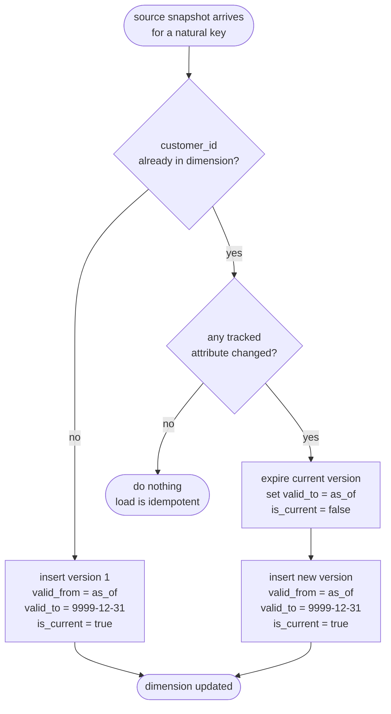

# Slowly-changing dimensions

Dimension attributes change: a customer moves city, a product is reclassified, a
sales rep changes territory. A **slowly-changing dimension** (SCD) is the policy
for what the warehouse does when a source attribute you care about changes. The
policy is chosen *per attribute*, and the choice is a business decision about
history, not a technical one.

## Type 1 — overwrite

Update the value in place. No history is kept; the dimension always reflects the
latest state.

```sql
-- Type 1: correct a mis-keyed email. The old value simply disappears.
UPDATE dim_customer
SET    email = 'new.address@example.test'
WHERE  customer_id = 5001
  AND  is_current;
```

Use Type 1 for attributes where history is meaningless or the change is a
*correction*: a fixed typo, a standardised spelling, a data-quality patch. After a
Type-1 update, every historical report re-states as if the value had always been
the new one — which is exactly what you want for a correction and exactly what you
do **not** want for a real-world change.

## Type 2 — add a new version

Preserve history by inserting a *new row* for the changed entity and expiring the
old one. The natural key is now shared by several rows — one per version — and each
version is bracketed by a validity window and flagged.

```sql
CREATE TABLE dim_customer (
    customer_key  BIGINT PRIMARY KEY DEFAULT nextval('seq_customer_key'),  -- per version
    customer_id   INTEGER NOT NULL,     -- natural key, stable across versions
    segment       VARCHAR NOT NULL,     -- tracked (Type 2)
    city          VARCHAR NOT NULL,     -- tracked (Type 2)
    region        VARCHAR NOT NULL,     -- tracked (Type 2)
    valid_from    DATE NOT NULL,
    valid_to      DATE NOT NULL,        -- 9999-12-31 while current
    is_current    BOOLEAN NOT NULL,
    version       INTEGER NOT NULL
);
```

When customer 5001 moves from Northgate to Rivermouth, the load closes version 1
and opens version 2 (real output from the demo):

```
customer_key | customer_id | segment   | city       | valid_from | valid_to   | is_current | version
-------------+-------------+-----------+------------+------------+------------+------------+--------
2            | 5001        | Corporate | Northgate  | 2024-01-01 | 2024-07-01 | False      | 1
201          | 5001        | Consumer  | Rivermouth | 2024-07-01 | 9999-12-31 | True       | 2
```

Two invariants make this correct:

- **The windows tile the timeline.** `valid_to` of one version equals `valid_from`
  of the next; the current version runs to `9999-12-31`. No gaps, no overlaps — so
  every date maps to exactly one version.
- **Exactly one current row per natural key.** `is_current` is a convenience flag
  for "give me the latest"; it must be true for precisely one row per `customer_id`.

### Why the fact points at the version, not the customer

A fact row stores the surrogate `customer_key` of the version that was current *on
the event date*. That single decision is what makes a Type-2 dimension worth the
effort: it freezes the context of each measurement.



The demo proves the payoff with one query: attributing sales to the customer
segment *as of the sale* (join on the fact's `customer_key`) versus *restating*
everything to each customer's current segment (hop to the current version via the
natural key). The grand totals match — same money — but the per-segment split
differs, and that difference is precisely the history a Type-1 overwrite would have
erased.

## Type 3 — previous-value column

Keep a single prior value in an extra column (`current_region`, `previous_region`).
Cheap, but it remembers only *one* step of history and only for attributes you
anticipated. Useful for "compare to the value before the last reorganisation"; a
poor substitute for full Type-2 history.

## Choosing per attribute

| Change | Policy | Why |
|---|---|---|
| Fixed a typo in a name | Type 1 | a correction; history should re-state |
| Customer genuinely moved city | Type 2 | past sales belong to the old city |
| Product reclassified into a new category | Type 2 | last year's numbers stay in the old category |
| Standardised a code's spelling | Type 1 | cosmetic, no analytical meaning |

Most real dimensions are **hybrid**: some columns Type 1, some Type 2, in the same
table. Decide attribute by attribute, and write the choice down — it is the kind of
decision a future analyst will otherwise reverse-engineer from surprising numbers.
The loader in this repo tracks `segment`, `city` and `region` as Type 2 and treats
name and email as stable descriptive fields.
